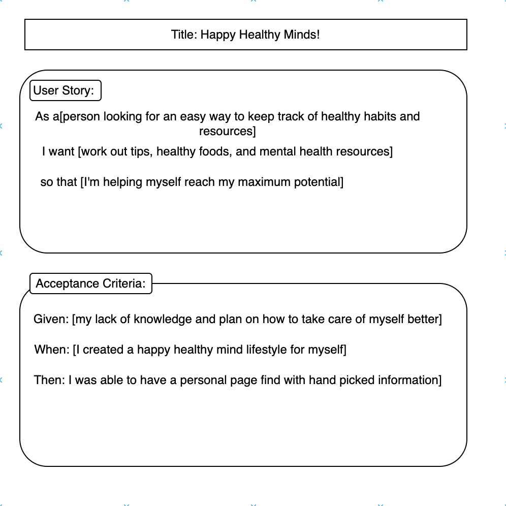
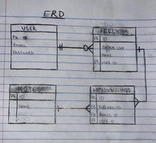
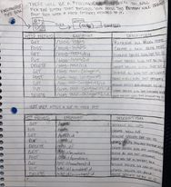

 # Soliloquy
 Welcome to my second project! This is my first fullstack website and I wanted to make something fun! Soliloquy (Middle English: from late Latin soliloquium, from Latin solus ‘alone’ + loqui ‘speak’), is a blog website where you can creates posts based off of how you're feeling and write comments about them and use GIPHY API. It's like a fun digital jernal just for you!

Here is the link! 

## Getting Started
---
I started with visualizing how I wanted my website to look, how I wanted it to run, and what it would actually be doing. Once I had a clear picture I started building my wireframe onto the computer. After the wirefame was built, being able to visually see it and all the paths made mading the ERDs and restful routing charts easier.

---

### (MVP Goals)
---
* Everything is running smoothly together and there are no bugs.
* Code is clean and easy to read/understand.
* Keep code as simple as possible.
* Make sure user has a good visual experience.

---

### (Stretch Goals)
---
* I would like to create a database that keeps track of the time, date, and feeling you picked.
* I would also like the database to give the user a % of the over all feelings you pick every time you create a post.
* If I have the time I would like the put a comment section on the users posted the that can add whatever they want to it.
* Create a website logo
* Let user choose a profile picture
* let user look up post by date

---

### (Potential Road Blocks)
---
* This is my first time making a website like this and pulling all the routes and everything involved together, my biggest concern are things getting confusing and going into deep dark holes. I want to practice orginazation as best as possible in this project to avoid that from happning.

---

### (Prerequasites)
---
* CSS
* Javascript
* SQL
* EXPRESS
* PG
* EJS
* bcrypt
* crytojs
* dotenv

## Wireframe
---
* Simple layout of what the website will look like!

---

### User Stories
---

---

### ERD

---

### Restful Routing Chart
---

---

### APIs I will be using
---
* GIPHY API
---

## The Process of Soliloquy!
---
(DAY ONE)

I started with finding an API that would work for my idea. Once I found them, I got started on my wireframe and built up what I wanted the website to look like. By the end of the day I have finished the set up before diving into the code.

(DAY TWO)

## Post Project
---

## Sources Used
---
