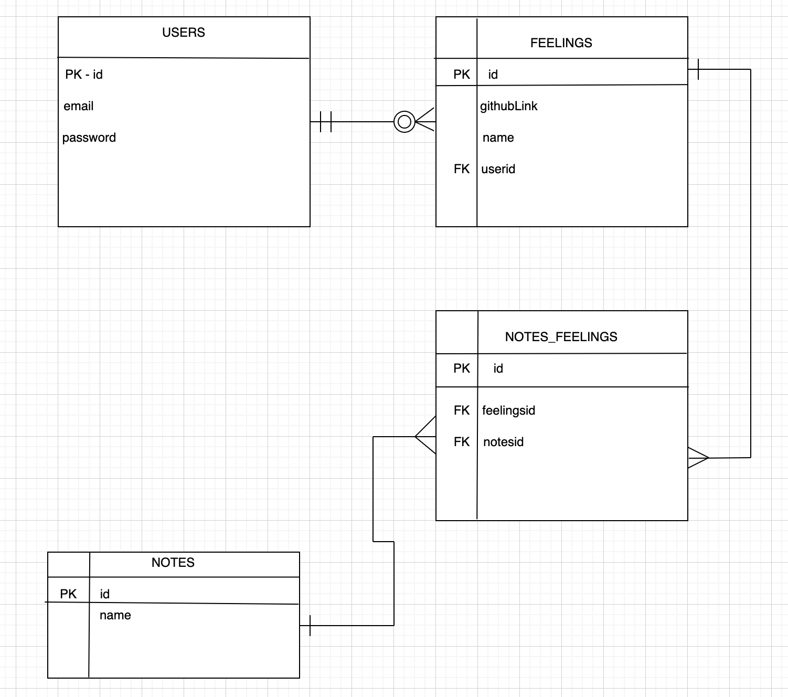

 # Happy Healthy Minds!
 Welcome to my second project! This is my first fullstack website and I wanted to do something meaningful with it! Mental health is very important to me, so I thought it would be cool to have a website that feeds you resources spacifically to your needs and gives you a organized, visually appealing place to store the information just for you!

Here is the link! 

## Getting Started
---
I started with visualizing how I wanted my website to look, how I wanted it to run, and what it would actually be doing. Once I had a clear picture I started building my wireframe onto the computer. After the wirefame was built, being able to visually see it and all the paths made mading the ERDs and restful routing charts easier.

---

### (MVP Goals)
---
* Everything is running smoothly together and there are no bugs.
* Code is clean and easy to read/understand.
* Keep code as simple as possible.
* Make sure user has a good visual experience.

---

### (Stretch Goals)
---
* I have extra routes and API's to make the website what I really want it to be. I would love to get all four of them up and running on my website but may not have the time. A new healthy foods/diets search page will be a strech goal as well as a mental health resources search page.
* I want the user to be able to search theirquestions, get information back, and be able to choose if they want to add it to their "personal health blog".
* User can choose different disigns for their blog.
* Make it so other users can comment.
* Make it so you and other users can react to comments and posts with an API gif.

---

### (Potential Road Blocks)
---
* This is my first time making a website like this and pulling all the routes and everything involved together, my biggest concern are things getting confusing and going into deep dark holes. I want to practice orginazation as best as possible in this project to avoid that from happning.

---

### (Prerequasites)
---
* CSS
* Javascript
* SQL
* EXPRESS

## Wireframe
---
* Simple layout of what the website will look like!

---

### User Stories
---

---

### ERD

---

### Restful Routing Chart
---

---

### My API I will be using

Link: https://rapidapi.com/mortimerbrian135/api/exerciseapi3/
---

## The Process of Happy Healthy Minds!
---
(DAY ONE)

I started with finding an API that would work for my idea. Once I found them, I got started on my wireframe and built up what I wanted the website to look like. By the end of the day I have finished the set up before diving into the code.

(DAY TWO)

## Post Project
---

## Sources Used
---
