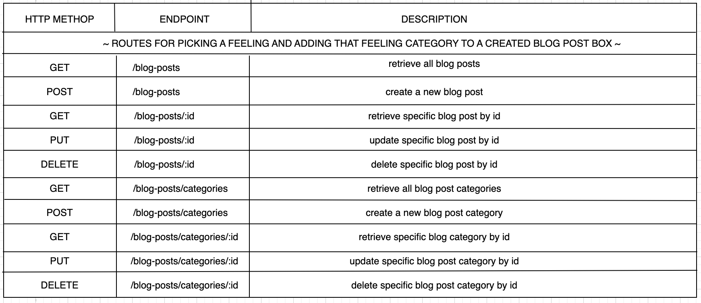

 # Soliloquy
 Welcome to my second project! This is my first fullstack website and I wanted to make something fun! Soliloquy (Middle English: from late Latin soliloquium, from Latin solus ‘alone’ + loqui ‘speak’), is a blog website where you can creates posts based off of how you're feeling and write comments about them and use GIPHY API. It's like a fun digital jernal just for you!

Here is the link! 
https://eroku.com/soliloquyap

## Getting Started
---
I started with visualizing how I wanted my website to look, how I wanted it to run, and what it would actually be doing. Once I had a clear picture I started building my wireframe onto the computer. After the wirefame was built, being able to visually see it and all the paths made mading the ERDs and restful routing charts easier.

---

### (MVP Goals)
---
* Everything is running smoothly together and there are no bugs.
* Code is clean and easy to read/understand.
* Keep code as simple as possible.
* Make sure user has a good visual experience.

---

### (Stretch Goals)
---
* I would like to create a database that keeps track of the time, date, and feeling you picked.
* I would also like the database to give the user a % of the over all feelings you pick every time you create a post.
* If I have the time I would like the put a comment section on the users posted the that can add whatever they want to it.
* Create a website logo
* Let user choose a profile picture
* let user look up post by date

---

### (Potential Road Blocks)
---
* This is my first time making a website like this and pulling all the routes and everything involved together, my biggest concern are things getting confusing and going into deep dark holes. I want to practice orginazation as best as possible in this project to avoid that from happning.

---

### (Prerequasites)
---
* CSS
* Javascript
* SQL
* EXPRESS
* PG
* EJS
* bcrypt
* crytojs
* dotenv

## Wireframe
---
* Simple layout of what the website will look like!

---

### User Stories
---

---

### ERD

---

### Restful Routing Chart
---

---

### APIs I will be using
---
* GIPHY API
---
### Installation Instructions
---
* Fork and clone the repo
* Run npm install (this will download all relevant packages)

## The Process of Soliloquy!
---
(DAY ONE)

I started with finding an API that would work for my idea. Once I found them, I got started on my wireframe and built up what I wanted the website to look like. By the end of the day I have finished the set up before diving into the code.

(DAY TWO)
First, I began with finalizing my application as a blog site. I also worked on creating the ERD and CRUD routes I was planning on using. I also was able to begin connecting my API.

(DAY THREE)
On day three, my main focus was establishing my CRUD routes and getting them connected. I was able to create routes that handled storing, destroying, creating, indexing, updating, and showing the data for the posts and the users.

(DAY FOUR)
I was able to incorporate the API key into my gif express route to get it fully connected. I established authentication routes and got the home page working with full functionality for signing up, logging in, and going to one's profile. I also was able to connect the style sheets to the ejs files and get the login/authentication page styled more. 

(DAY FIVE)
I got the forms loading and displaying and my CRUD routes functioning with the comments and posts. I then connected the routes to the controllers and got the posts rendering on the screen. I created the routes for storing, destroying, creating, indexing, updating, and showing the data for the comments and also established one to many relationships among users, posts, and comments. I got my gif page loading and rendering data from the api. While establishing my one to many relationships, I also got a chance to look into my database and notice that my comments table was improperly set up and so was my posts. I was able to fix this bug by dropping the data and manipulating my database with the proper info. Lastly, I got the home page directing to the necessary routes like the /posts and /gifs. 

(DAY SIX)
I finished styling all of my pages and was able to add a background with a lower opacity that doesn't take away from the website's features. I also was able to add the gifs model and establish one to many relationships with the posts. This involved dropping all relevant tables and ensuring they had a common key. I also fixed the config files and placed most of my focus on polishing up and debugging before deployment.

## Post Project
---

## Sources Used
---
